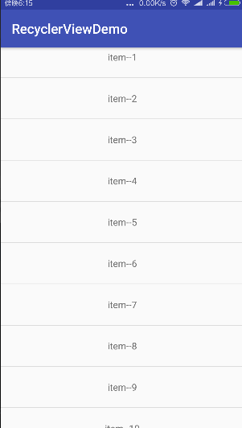
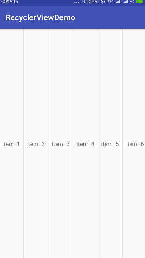
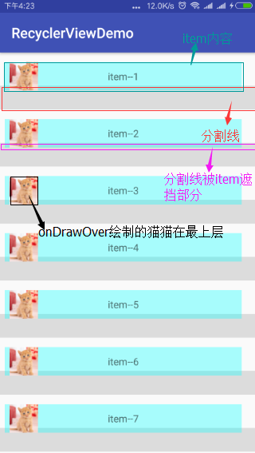
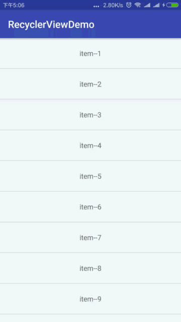
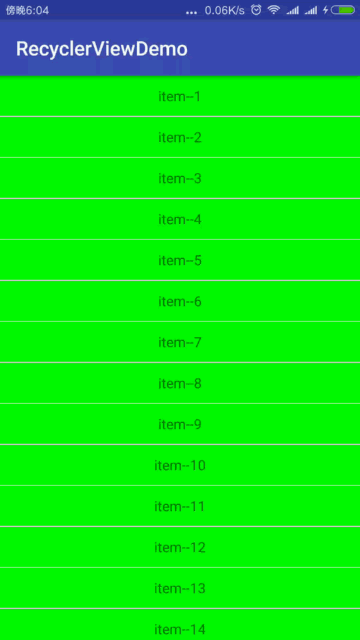

**简介：**
    由于之前在项目中使用到RecyclerView的时候只做了简单的学习，以满足项目需求，
最近得空将RecyclerView相关知识整理整理，发表此篇文章仅作为个人知识梳理，也希望
能帮助到需要的人。
    RecyclerView用于在有限的窗口展现大量的数据，相比ListView、GridView，
RecyclerView标准化了ViewHolder，而且用法非常的灵活，可以实现很多ListView实现
不了的样式和功能。接下来我们由浅入深逐步探索RecyclerView的各种使用。

**基本知识：**
* 简单快速的上手
* 通用的adapter定义，ViewHolder是item的控件引用，adapter用于展示（绑定）数据
* Item的点击和长点击事件需要自己去实现。
* RecyclerView定制Item的间隔样式
* 设置Item操作的动画，自定义动画效果
* 布局管理器LayoutManager用来控制Item的布局方式（横向、竖向、网格或者瀑布流方式）


**1、基本用法：** <br/>
①、在build.gradle中引入RecyclerView:
implementation 'com.android.support:recyclerview-v7:26.1.0'
②、布局文件
```xml
    <LinearLayout xmlns:android="http://schemas.android.com/apk/res/android"
        android:layout_width="match_parent"
        android:layout_height="match_parent"
        android:orientation="vertical">
        <android.support.v7.widget.RecyclerView
            android:id="@+id/recyclerView"
            android:layout_width="match_parent"
            android:layout_height="match_parent"/>
    </LinearLayout>
```
③、设置布局管理器和adapter
```Java
    // 设置布局管理器
    RecyclerView.LayoutManager mLayoutManager = new LinearLayoutManager(this,
            LinearLayoutManager.VERTICAL, false);
    recyclerView.setLayoutManager(mLayoutManager);
    // 设置adapter
    adapter = new CommandRecyclerAdapter<String>
            (this, R.layout.item_vertical, dataList) {
        @Override
        public void convert(ViewHolder holder, String str) {
            holder.setText(R.id.tv_item, str);
        }
        @Override
        public void onItemClick(String str, int position) {
        }
    };
    recyclerView.setAdapter(adapter);
     //③. 设置Item之间间隔样式
    recyclerView.addItemDecoration(new DividerItemDecoration(
            this, LinearLayoutManager.VERTICAL));
```

④、效果展示
&emsp&emsp&emsp&emsp

**2、通用Adapter && 点击事件**

    在上面的示例中，我们只需要3步就能从无到有的将RecyclerView展示出来，但实际上并没有那么简单，
上面使用的Adapter是通过封装后的一个通用的Adapter，能适用于日常开发绝大多数的要求，下面我们看看
里面的结构是怎样的。
    在此之前，我们先对比一下之前我们使用的Adapter（比如ListView的），创建Adapter时，需要重写几个
重要的方法：getCount()、getView()...，通常说到优化就是使用ViewHolder，但是这并不是强制的，如果
不用也可以，那就每次都findView去。RecyclerView中规范了ViewHolder，变成了强制性的，在RecyclerView.Adapter的onBindViewHolder(ViewHolder holder, int position)
方法中（相当于ListView Adapter的getView()方法），ViewHolder作为参数传递过来，绑定数据时就必须使用此viewHolder对象了。
    那说到底ViewHolder到底是个什么东西呢？它是用来维护Item中控件的引用的，如果复用Item，就能避免很多findView的操作从而优化内存开销，
RecyclerView之所以这样，就是为了规范化这个东西，说到底ViewHolder就是一个简单的类，里面维护了item控件的引用。
    Adapter是个什么东西就不用说了吧？数据适配器，告诉RecyclerView有多少个条目，然后给每个条目绑定数据。
值得注意的是RecyclerView并没有暴露Item的点击事件，我们可以在绑定数据的时候为Item设置点击和长点击事件。
    下面看看相关代码：
```Java
    public class ViewHolder extends RecyclerView.ViewHolder {
        private SparseArray<View> mViews;   //用于维护item中子控件的引用
        private View mConvertView;
        private Context mContext;

        public ViewHolder(Context context, View itemView, ViewGroup parent) {
            super(itemView);
            mContext = context;
            mConvertView = itemView;
            mViews = new SparseArray<>();
        }

        /**根据item布局id创建一个ViewHolder，Adapter中调用*/
        public static ViewHolder get(Context context, ViewGroup parent, int layoutId) {
            View itemView = LayoutInflater.from(context).inflate(layoutId, parent, false);
            ViewHolder holder = new ViewHolder(context, itemView, parent);
            return holder;
        }

        /**
         * 通过viewId获取控件
         * @param viewId
         * @return
         */
        private <T extends View> T getView(int viewId) {
            View view = mViews.get(viewId);
            if (view == null) {
                view = mConvertView.findViewById(viewId);
                mViews.put(viewId, view);
            }
            return (T) view;
        }

        /**为条目或者指定控件设置点击和长点击事件，在adapter中调用*/
        public ViewHolder setOnClickListener(int viewId,  View.OnClickListener listener) {
            if(viewId==-1){
                mConvertView.setOnClickListener(listener);
            }else{
                View view = getView(viewId);
                view.setOnClickListener(listener);
            }
            return this;
        }
        public ViewHolder setOnLongClickListener(int viewId,  View.OnLongClickListener listener) {
            if(viewId==-1){
                mConvertView.setOnLongClickListener(listener);
            }else{
                View view = getView(viewId);
                view.setOnLongClickListener(listener);
            }
            return this;
        }

        /**下面的方法暴露出去，用于绑定数据，如果不够用可以扩充*/

        public ViewHolder setVisible(int viewId, int visible) {
            getView(viewId).setVisibility(visible);
            return this;
        }
        public ViewHolder setTextColor(int viewId, int color) {
            TextView tv = getView(viewId);
            tv.setTextColor(color);
            return this;
        }
        public ViewHolder setText(int viewId, CharSequence text) {
            TextView tv = getView(viewId);
            tv.setText(text);
            return this;
        }
        @SuppressLint("NewApi")
        public ViewHolder setBackgroundResource(int viewId, int id) {
            View view = getView(viewId);
            if(0==id)
                view.setBackground(null);
            else
                view.setBackgroundResource(id);
            return this;
        }
        public ViewHolder setImageResource(int viewId, int resId) {
            ImageView view = getView(viewId);
            view.setImageResource(resId);
            return this;
        }
        public ViewHolder setCheckBoxChecked(int viewId, boolean check) {
            CheckBox cb = getView(viewId);
            cb.setChecked(check);
            return this;
        }
        public ViewHolder setLinearLayoutBgIcon(int viewId, int  iconResourse) {
            LinearLayout ll = getView(viewId);
            ll.setBackgroundResource(iconResourse);
            return this;
        }

    }
```

```Java
    public abstract class CommandRecyclerAdapter<T> extends RecyclerView.Adapter<ViewHolder> {
        protected Context mContext;
        protected int mLayoutId;
        protected List<T> mDatas;
        protected LayoutInflater mInflater;

        public CommandRecyclerAdapter(Context context, int layoutId, List<T> datas) {
            mDatas = new ArrayList<>();
            mContext = context;
            mInflater = LayoutInflater.from(context);
            mLayoutId = layoutId;
            if(datas!=null)
                mDatas.addAll(datas);
        }

        /**Adapter最重要的三个方法getItemCount()、onCreateViewHolder()、onBindViewHolder()*/
        @Override
        public int getItemCount(){
            return mDatas.size();
        }
        @Override
        public ViewHolder onCreateViewHolder(final ViewGroup parent, int viewType){
            ViewHolder viewHolder = ViewHolder.get(mContext, parent, mLayoutId);
            return viewHolder;
        }
        @Override
        public void onBindViewHolder(ViewHolder holder, final int position) {
            convert(holder, mDatas.get(position));
            /**为item设置点击和长点击事件*/
            holder.setOnClickListener(-1, new View.OnClickListener() {
                @Override
                public void onClick(View v) {
                    onItemClick(mDatas.get(position), position);
                }
            });
            holder.setOnLongClickListener(-1, new View.OnLongClickListener() {
                @Override
                public boolean onLongClick(View v) {
                    return onItemLongClick(mDatas.get(position), position);
                }
            });
        }

        /**数据设置、添加、删除相关方法*/
        public void setData(List<T> datas){
            mDatas.clear();
            if(datas!=null)
                mDatas.addAll(datas);
            notifyDataSetChanged();
        }
        public void addData(int position,T t){
            if(null!=mDatas)
                mDatas.add(position, t);
            notifyItemRemoved(position);
        }
        public void addDatas(int position, List<T> datas){
            if(datas!=null)
                mDatas.addAll(position, datas);
            notifyItemRemoved(position);
        }
        public void removeData(int position){
            if(null!=mDatas && mDatas.size()>position) {
                mDatas.remove(position);
                notifyItemRemoved(position);
            }
        }
        public void removeDatas(List<Integer> positions){
            if(null!=mDatas){
                for(int position:positions){
                    if(mDatas.size()>position) {
                        mDatas.remove(position);
                        notifyItemRemoved(position);
                    }
                }
            }
        }

        /**重写此方法，将数据绑定到控件上*/
        public abstract void convert(ViewHolder holder, T t);
        /**item点击和长点击事件*/
        public abstract void onItemClick(T data, int position);
        public boolean onItemLongClick(T data, int position){
            return true;
        }
    }
```

**使用方法**：
    创建adapter时，需要传入Context、item布局id、数据集合，然后实现convert()、onItemClick()方法，
convert()方法用来为item控件绑定数据，拿着holder就能获取到item中的所有控件对象，而item点击事件使用还是
非常多的，所以抽象了一下，使用时必须实现；相比长点击事件就使用没那么多，如果要为item设置长点击事件，
就重写onItemLongClick()方法即可。数据类型可以是任意Object的子类，这样就能使用各种数据类型的绑定。
```Java
    adapter = new CommandRecyclerAdapter<String>
            (this, R.layout.item_vertical, dataList) {
        @Override
        public void convert(ViewHolder holder, String str) {
            holder.setText(R.id.tv_item, str);
        }
        @Override
        public void onItemClick(String str, int position) {
        }
        @Override
        public boolean onItemLongClick(String data, int position) {
            return super.onItemLongClick(data, position);
        }
    };
    recyclerView.setAdapter(adapter);
```

**3、间隔样式ItemDecoration**
    上面的效果看起来非常不和谐，整个一大块，老的ListView可以设置driver属性就能将item之间隔开，
而RecyclerView并没有提供driver属性，因为它的间隔样式更加灵活，需要我们自己去实现。
    添加间隔样式使用`recyclerView.addItemDecoration(RecyclerView.ItemDecoration)`，传递一个RecyclerView.ItemDecoration
的子类，RecyclerView提供了默认的实现类DividerItemDecoration，我们看看效果：
```Java
    //③. 设置Item之间间隔样式
    recyclerView.addItemDecoration(new DividerItemDecoration(
            this, LinearLayoutManager.VERTICAL));
```
&emps&emps&emps

&emsp&emsp默认的间隔样式的实现就是一条分割线，这条分割线的高度、颜色是不能设置的，查看DividerItemDecoration
的源码，发现绘制分割线的高度和颜色是从一个android.R.attr.listDivider的属性中获取的，RecyclerView并没有提供这个属性，
所以可以想象使用的是系统默认的属性值。其实一条分割线在绝大多数的场景中已经足够使用，但如果我们有其他的需求（分割线高度或者颜色变一下）
怎么办呢？那就实现RecyclerView.ItemDecoration，定义自己的间隔样式，ItemDecoration不是一个抽象类，默认的实现都是空，
所以直接使用是没有任何效果的。
&emsp&emsp首先我们看看RecyclerView.ItemDecoration中都有那些方法，分别有什么用途：

**3.1.getItemOffsets()**

&emsp&emsp这个方法用于设置item的偏移量，偏移的部分用于填充间隔样式。
跟踪源码RecyclerView中只有有一个getItemDecorInsetsForChild()方法调用了getItemOffsets()，而
getItemDecorInsetsForChild()方法返回了一个insets，这里面包含了所有item的间隔的left、top、right、bottom
之和：
```Java
    Rect getItemDecorInsetsForChild(View child) {
        ...
        final Rect insets = lp.mDecorInsets;
        insets.set(0, 0, 0, 0);
        final int decorCount = mItemDecorations.size();
        for (int i = 0; i < decorCount; i++) {
            mTempRect.set(0, 0, 0, 0);
            mItemDecorations.get(i).getItemOffsets(mTempRect, child, this, mState);
            insets.left += mTempRect.left;
            insets.top += mTempRect.top;
            insets.right += mTempRect.right;
            insets.bottom += mTempRect.bottom;
        }
        lp.mInsetsDirty = false;
        return insets;
    }
```
 &emps&emps&emps

而继续跟踪发现measureChild()方法会调用getItemDecorInsetsForChild()，measureChild()方法的意思就是测量item的高度
，之前我们学习onMeasure方法的时候会说父控件调用子控件的measure()方法时会传入父控件的测量建议（父控件剩余的宽高
和测量模式），看下面的代码可以发现，剩余的宽高计算时会去除RecyclerView的Padding值和所有item间隔所占用的空间，
所以RecyclerView的总宽高=Padding+所有item间隔+所有item的宽高，而getItemOffsets()中为outRect设置设置的left、top、right、bottom
值将会加到item对应的padding中去，下面我们看看重写getItemOffsets()后的效果。

```Java
    public void getItemOffsets(Rect outRect, View view, RecyclerView parent, RecyclerView.State state) {
        if (mOrientation == VERTICAL_LIST) {
            outRect.set(20, 40, 60, 80);
        } else {
            outRect.set(20, 40, 60, 80);
        }
    }
```
&emps&emps&emps

**3.2.onDraw() & onDrawOver()**
    ItemDecoration的onDraw()会在item的onDraw()方法之前执行，ItemDecoration的onDrawOver()会在item的onDraw()方法
之后执行。这样的关系会导致绘制层级，ItemDecoration的onDraw()绘制在最底层，item在中间，onDrawOver()绘制在最上面。
下面看看全部代码及效果图：
```Java
    public class MyDividerItemDecoration extends RecyclerView.ItemDecoration{
        private static final int[] ATTRS = new int[]{
                android.R.attr.listDivider
        };
        public static final int HORIZONTAL_LIST = LinearLayoutManager.HORIZONTAL;
        public static final int VERTICAL_LIST = LinearLayoutManager.VERTICAL;
        /**用于绘制间隔样式*/
        private Drawable mDivider;
        /**列表的方向，水平/竖直 */
        private int mOrientation;

        private Paint paint;
        private Bitmap bitmap;

        public MyDividerItemDecoration(Context context, int orientation) {
            // 获取默认主题的属性
            final TypedArray a = context.obtainStyledAttributes(ATTRS);
            mDivider = a.getDrawable(0);
            a.recycle();
            setOrientation(orientation);

            paint = new Paint();
            paint.setAntiAlias(true);
            bitmap = BitmapFactory.decodeResource(context.getResources(), R.drawable.cat);
        }

        private void setOrientation(int orientation) {
            if (orientation != HORIZONTAL_LIST && orientation != VERTICAL_LIST) {
                throw new IllegalArgumentException("invalid orientation");
            }
            mOrientation = orientation;
        }
        @Override
        public void getItemOffsets(Rect outRect, View view, RecyclerView parent, RecyclerView.State state) {
            if (mOrientation == VERTICAL_LIST) {
                outRect.set(20, 40, 60, 80);
            } else {
                outRect.set(20, 40, 60, 80);
            }
        }
        /**onDraw方法会在item绘制之前调用，这里用来绘制item的间隔，可能会被item遮挡 */
        @Override
        public void onDraw(Canvas c, RecyclerView parent, RecyclerView.State state) {
            if (mOrientation == VERTICAL_LIST) {
                //获取分隔线左右坐标
                final int left = parent.getPaddingLeft();   //RecyclerView的左padding值
                final int right = parent.getWidth() - parent.getPaddingRight();  //RecyclerView减去right padding值后右边坐标
                final int childCount = parent.getChildCount();
                for (int i = 0; i < childCount; i++) {
                    final View child = parent.getChildAt(i);
                    final RecyclerView.LayoutParams params = (RecyclerView.LayoutParams) child.getLayoutParams();
                    //分割线绘制的top位置=item底端+item底部margin值+item偏移量 - 20
                    final int top = child.getBottom() + params.bottomMargin +
                            Math.round(ViewCompat.getTranslationY(child))-20;
                    //分割线底部 = top + 20的overdraw + 底部80偏移值
                    final int bottom = top + 20 + 80;
                    mDivider.setBounds(left, top, right, bottom);
                    mDivider.draw(c);
                }
            } else {
               //此处绘制水平方向排列时的间隔样式，省略
            }
        }
        /**onDrawOver方法会在item绘制之后调用，这层绘制将会显示在最上层 */
        @Override
        public void onDrawOver(Canvas c, RecyclerView parent, RecyclerView.State state) {
            if (mOrientation == VERTICAL_LIST) {
                final int childCount = parent.getChildCount();
                for (int i = 0; i < childCount; i++) {
                    final View child = parent.getChildAt(i);
                    //在item的头部画一只猫
                    c.drawBitmap(bitmap, new Rect(0, 0,bitmap.getWidth(), bitmap.getHeight()),
                            new Rect(child.getLeft()+20, child.getTop(),
                                    child.getLeft()+20+(child.getBottom()-child.getTop()),
                                    child.getBottom()),paint);
                }
            } else {
                //此处绘制水平方向排列时的遮罩，省略
            }
        }
    }
```



上面的实现效果基本上将三个方法的作用及使用场景都说明白了，效果图看起来很丑，不过这都没关系，只要弄明白其原理，
想弄成什么样子都可以的。

**4、动画**
通过RecyclerView.setItemAnimator()可以设置item的动画（item添加、删除、修改变换的动画），
该方法接受一个RecyclerView.ItemAnimator对象，同样系统为我们提供了一个默认的实现类DefaultItemAnimator，
DefaultItemAnimator中实现了add、remove、move、change四种动画，下面我们看看怎么使用：

4.1. 系统提供的默认动画实现
①、设置Item动画
```Java
    recyclerView.setItemAnimator(new DefaultItemAnimator());
```
②、adapter中编写添加或者删除item的方法
```Java
    public void addData(int position,T t){
        if(null!=mDatas) {
            mDatas.add(position, t);
            notifyItemInserted(position);
            if (position != mDatas.size()) {
                //刷新改变位置item下方的所有Item的位置,避免索引错乱
                notifyItemRangeChanged(position, mDatas.size() - position);
            }
        }
    }
    public void removeData(int position){
        if(null!=mDatas && mDatas.size()>position) {
            mDatas.remove(position);
            notifyItemRemoved(position);
            if (position != mDatas.size()) {
                //刷新改变位置item下方的所有Item的位置,避免索引错乱
                notifyItemRangeChanged(position, mDatas.size() - position);
            }
        }
    }
```
③、点击新增、长按删除
```Java
    adapter = new CommandRecyclerAdapter<String>
            (this, R.layout.item_vertical, dataList) {
        @Override
        public void convert(ViewHolder holder, String str) {
            holder.setText(R.id.tv_item, str);
        }
        //点击事件，在下方添加一个item
        @Override
        public void onItemClick(String str, int position) {
            Log.i(getClass().getSimpleName(), "添加item"+position);
            adapter.addData(position+1, "新添加的item--"+(position+1));
        }
        //长按事件，删除item
        @Override
        public boolean onItemLongClick(String data, int position) {
            adapter.removeData(position);
            return true;
        }
    };
    recyclerView.setAdapter(adapter);
```



当数据集合发生变化后，不能用Adapter.notifyDataSetChanged()刷新，否则会导致动画不执行，
要使用下面四个方法：
```Java
    Adapter.notifyItemInserted(int position)
    Adapter.notifyItemRemoved(int position)
    Adapter.notifyItemChanged(int position)
    Adapter.notifyItemMoved(int fromPosition, int  toPosition)
```
使用这四个方法只是视图上的变化，item的索引及ViewHolder的引用并没有刷新，这会导致位置错乱，
调用上面方法后，需要使用下面的代码刷新变化的item下方所有item的位置，避免错乱。
```Java
    if (position != mDatas.size()) {
        //刷新改变位置item下方的所有Item的位置,避免索引错乱
        notifyItemRangeChanged(position, mDatas.size() - position);
    }
```

4.2. 自定义动画效果
    对于自定义的动画效果，官方没有给出相应的示例，我们看看ItemAnimator的代码何其子类的代码量也都不少，
自己实现是不太可能，那能不能直接修改默认的动画效果呢？当然是可以的，此处我们创建一个类MyItemAnim复制DefaultItemAnimator
的源码，稍作修改。DefaultItemAnimator中涉及到动画的关键方法有下面八个,分别对应添加、删除、移动和修改动画：
```Java
    animateAdd()
    animateAddImpl()

    animateRemove()
    animateRemoveImpl()

    animateMove()
    animateMoveImpl()

    animateChange()
    animateChangeImpl()
```

我们挑选add动画修改一下（在之前的源码上添加平移的动画）：

```Java
   @Override
   public boolean animateAdd(final RecyclerView.ViewHolder holder) {
       //重置动画，将itemView置为准备添加的状态
       resetAnimation(holder);
       ViewCompat.setAlpha(holder.itemView, 0);
       //在透明度变化的基础上添加一个平移动画，初始位置为左侧不可见
       ViewCompat.setTranslationX(holder.itemView,-holder.itemView.getWidth());
       mPendingAdditions.add(holder);
       return true;
   }

   void animateAddImpl(final RecyclerView.ViewHolder holder) {
       final View view = holder.itemView;
       final ViewPropertyAnimator animation = view.animate();
       mAddAnimations.add(holder);
       //在之前基础上添加平移动画，从-item.getWidth移动到0的位置
       animation.alpha(1).translationX(0).setDuration(getAddDuration())
               .setListener(new AnimatorListenerAdapter() {
                   @Override
                   public void onAnimationStart(Animator animator) {
                       dispatchAddStarting(holder);
                   }

                   @Override
                   public void onAnimationCancel(Animator animator) {
                       view.setAlpha(1);
                   }

                   @Override
                   public void onAnimationEnd(Animator animator) {
                       animation.setListener(null);
                       dispatchAddFinished(holder);
                       mAddAnimations.remove(holder);
                       dispatchFinishedWhenDone();
                   }
               }).start();
   }
```

使用自定义的动画：
```Java
    // 设置Item添加和移除的动画
    MyItemAnim anim = new MyItemAnim();
    //设置动画持续时间
    anim.setAddDuration(1500);
    recyclerView.setItemAnimator(anim);
```




**5、三种布局管理器**
RecyclerView提供了三种布局管理器：
* LinerLayoutManager 以垂直或者水平列表方式展示item
* GridLayoutManager 以网格方式展示item
* StaggeredGridLayoutManager 以瀑布流方式展示item

**5.1.LinerLayoutManager**
    上面的示例中都使用的是LinerLayoutManager，接下来我们看看GridLayoutManager和StaggeredGridLayoutManager。

**5.2.GridLayoutManager**
GridLayoutManager是网格样式的管理器，其效果与GridView差不多，

**5.3.StaggeredGridLayoutManager**


